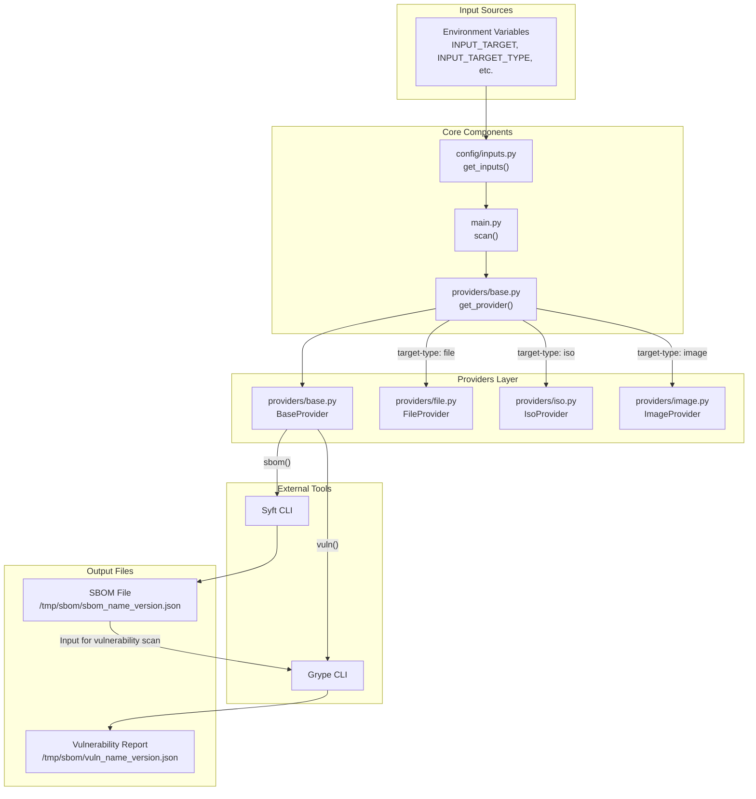
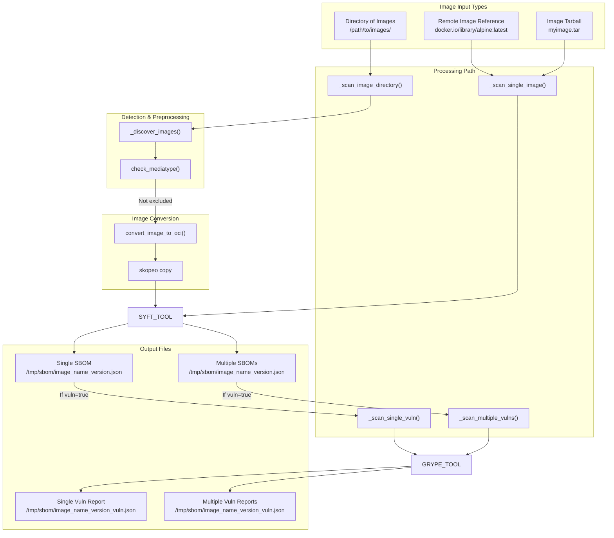
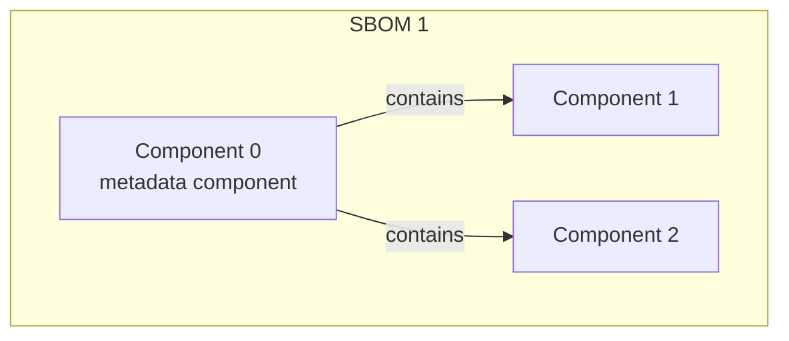
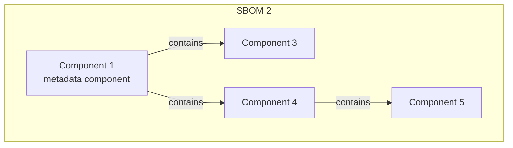
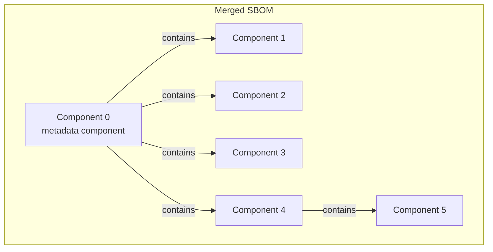
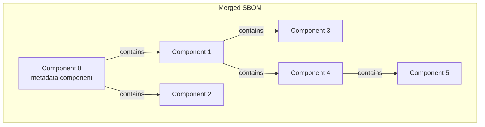

# Generate SBOM GitHub Action

[](https://github.com/scality/sbom/releases/latest)
[](https://github.com/scality/sbom/blob/main/LICENSE)

A GitHub Action for creating a software bill of materials (SBOM)
using [Syft](https://github.com/anchore/syft), with optional vulnerability scanning using [Grype](https://github.com/anchore/grype).

## Basic Usage

```yaml
- uses: scality/sbom@v2
  with:
    target: /usr/local/bin
```

This will create SBOM result file like `/tmp/sbom/bin_sbom.json` in the default output directory `/tmp/sbom`. 

## Configuration

### scality/sbom

The main [SBOM action](action.yaml) is responsible for generating SBOMs.

| Parameter            | Description                                                                                 | Default      |
| -------------------- | ------------------------------------------------------------------------------------------- | ------------ |
| `grype-version`      | Grype version to use                                                                        | `0.99.1`     |
| `syft-version`       | Syft version to use                                                                         | `1.29.0`     |
| `target`             | The target to scan (path or image)                                                          | `./`         |
| `target-type`        | Type of target to scan (file, directory, image, iso)                                        | `file`       |
| `output-format`      | Format of the generated SBOM <br> (cyclonedx-json cyclonedx-xml github-json spdx-json spdx-tag-value syft-json syft-table syft-text template) | `cyclonedx-json` |
| `output-file`        | A specific file location to store the SBOM                                                  |              |
| `output-dir`         | Directory to store generated SBOM files                                                     | `/tmp/sbom`  |
| `exclude-mediatypes` | Media types to exclude for images (comma-separated)                                         |              |
| `distro`             | Linux distribution of the target (if not auto-detected)                                     |              |
| `name`               | Override the detected name of the target                                                    |              |
| `version`            | Override the detected version of the target                                                 |              |
| `merge`              | Merge multiple SBOMs into a single file                                                     | `false`      |
| `merge_hierarchical` | Merge multiple SBOMs into a single hierarchical file                                        | `false`      |
| `vuln`               | Enable vulnerability scanning                                                               | `false`      |
| `vuln-output-format` | Format for the vulnerability report when `vuln` is enabled<br>(supports `json`, `html`, `csv`, `table`, or comma-separated values like `html,json`) | `cyclonedx-json`|
| `vuln-output-file`   | A specific file location to store the vulnerability report                                  |              |

## Example Usage

### Scan with a specific format

Use the `output-format` and `vuln-output-format` parameters to choose the SBOM and vulnerability report formats:

```yaml
- uses: scality/sbom@v2
  with:
    target: ./artifacts
    output-format: cyclonedx-json  # SBOM format
    vuln: true                     # Enable vulnerability scanning
    vuln-output-format: html       # Generate HTML vulnerability report
```

The HTML format provides an interactive report with a dynamic table for better visualization of vulnerabilities, allowing for easier filtering and sorting.

### Multiple vulnerability report formats

You can generate multiple formats simultaneously by using comma-separated values:

```yaml
- uses: scality/sbom@v2
  with:
    target: ./artifacts
    vuln: true
    vuln-output-format: html,json  # Generate both HTML and JSON reports
```

### Specify target type explicitly

```yaml
- uses: scality/sbom@v2
  with:
    target: myimage.tar
    target-type: image
```

### Exclude mediatypes for container images

For images (like those built using Oras) that use custom mediatypes not supported by Skopeo:

```yaml
- uses: scality/sbom@v2
  with:
    target: ./images
    target-type: image
    exclude-mediatypes: "application/my-configuration+json,text/nginx-config"
```

### Enable vulnerability scanning

```yaml
- uses: scality/sbom@v2
  with:
    target: ./
    vuln: true
```

### Full Example

```yaml
name: "Generate SBOM"
on:
  workflow_dispatch:
  workflow_call:
jobs:
  generate-sbom:
    runs-on: ubuntu-22.04
    env:
      BASE_PATH: ${{ github.workspace }}/workdir
      SBOM_PATH: ${{ github.workspace }}/artifacts/sbom
    steps:
      - name: Create directories
        shell: bash
        run: |
          mkdir -p ${{ env.BASE_PATH }}/repo
          mkdir -p ${{ env.BASE_PATH }}/iso
          mkdir -p ${{ env.SBOM_PATH }}
          
      - name: Checkout repo for scanning
        uses: actions/checkout@v4  
        with:  
          fetch-depth: 0  
          fetch-tags: true
          path: ${{ env.BASE_PATH }}/repo/myrepo
          
      - name: Generate SBOM for repository
        uses: scality/sbom@v2
        with:
          target: ${{ env.BASE_PATH }}/repo/myrepo
          target-type: file
          output-dir: ${{ env.SBOM_PATH }}
          
      - name: Download artifacts
        shell: bash
        env:
          ARTIFACTS_URL: ${{ steps.artifacts.outputs.link }}
          ARTIFACTS_USER: ${{ secrets.ARTIFACTS_USER }}
          ARTIFACTS_PASSWORD: ${{ secrets.ARTIFACTS_PASSWORD }}
        run: |
          echo "Downloading my.iso from $ARTIFACTS_URL"
          curl -sSfL -o ${{ env.BASE_PATH }}/iso/my.iso -u $ARTIFACTS_USER:$ARTIFACTS_PASSWORD $ARTIFACTS_URL/my.iso
          
      - name: Generate SBOM for ISO
        uses: scality/sbom@v2
        with:
          target: ${{ env.BASE_PATH }}/iso/my.iso
          target-type: iso
          version: "1.0.0"
          output-dir: ${{ env.SBOM_PATH }}
          vuln: true
          vuln-output-format: html
          merge: true
          merge_hierarchical: true
          
      - name: Upload artifacts
        uses: actions/upload-artifact@v4
        with:
          name: sbom-files
          path: ${{ env.SBOM_PATH }}/*.json
```

## CycloneDX Metadata

In the generated SBOM files, you will find CycloneDX metadata. Examples include:

- **For container images:**

```json
{
    "$schema": "http://cyclonedx.org/schema/bom-1.6.schema.json",
    "bomFormat": "CycloneDX",
    "specVersion": "1.6",
    "serialNumber": "urn:uuid:984d102d-0992-4dae-be80-ba551bc2079a",
    "version": 1,
    "metadata": {
        "timestamp": "2024-05-07T09:43:34Z",
        "tools": {
            "components": [
                {
                    "type": "application",
                    "author": "anchore",
                    "name": "syft",
                    "version": "1.32.0"
                }
            ]
        },
        "component": {
            "bom-ref": "1b58496ca93cc57d",
            "type": "container",
            "name": "my.iso:alpine",
            "version": "1.1.1"
        }
    }
}
```

- **For ISO files:**

```json
{
    "$schema": "http://cyclonedx.org/schema/bom-1.6.schema.json",
    "bomFormat": "CycloneDX",
    "specVersion": "1.6",
    "serialNumber": "urn:uuid:db2bc22b-a5e5-49a9-9d02-61a18480ead4",
    "version": 1,
    "metadata": {
        "timestamp": "2024-05-07T09:41:46Z",
        "tools": {
            "components": [
                {
                    "type": "application",
                    "author": "anchore",
                    "name": "syft",
                    "version": "1.32.0"
                }
            ]
        },
        "component": {
            "bom-ref": "4a057776eee09e2f",
            "type": "file",
            "name": "my.iso",
            "version": "1.0.0"
        }
    }
}
```

## Core Workflow



## Image Processing Workflow



## Data Flow Explanation

### Input Processing

1. Environment variables (from GitHub Actions) are read by `config/inputs.py`.
2. CLI arguments are processed by Click in `main.py`.
3. The input sources are combined with CLI arguments taking precedence.

### Provider Selection & SBOM Generation

1. The target type is determined from the provided inputs.
2. The `get_provider()` factory function selects the appropriate provider.
3. The provider’s `sbom()` method invokes Syft to generate the SBOM, which is saved with a standardized naming scheme: `{target_type}_{name}_{version}.json`.

### Vulnerability Scanning (if enabled)

1. If `vuln` is enabled, the provider’s `vuln()` method uses Grype to scan the SBOM.
2. Grype generates a vulnerability report saved as: `{target_type}_{name}_{version}_vuln.json`.

## Merge Explanation

The merge is per default not hierarchical for the `components` field of a `component`. This means that components that were contained in the `components` of an already present component will just be added as new components under the SBOMs’ `components` sections. The `--hierarchical` flag allows for hierarchical merges. This affects only the top level components of the merged SBOM. The structured of nested components is preserved in both cases (except the removal of already present components), as shown for *component 4* in the image below.





### Default merge:



### Hierarchical merge:



### References
- [CycloneDX Specification](https://cyclonedx.org/docs/1.6/json/)
- [CycloneDX Merge](https://festo-se.github.io/cyclonedx-editor-validator/usage/merge.html)
